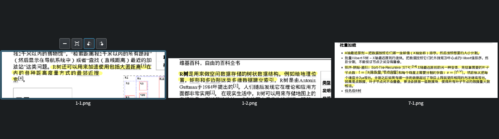

# Xopp-Annotation-Crop-And-Export
> 读取 Xournal++ 中 PDF 批注的高亮信息，导出成切片截图

## 用途
使用 Xournal++ 阅读 PDF 书籍，希望在阅读结束后将高亮所在区域导出成切片，以便其他软件处理

## 示例
demo/import 目录中有一个使用 Xournal++ 标记的 PDF 文件，经过该软件处理后的输出结果如下图所示：


文件名含义为：`{页码}-{页面内高亮区域}.png`

## 限制
- 只支持 Xournal++ 的高亮直线（即荧光笔直线工具，其他均不支持）

## 使用
```bash
# 以 Arch Linux 为例，其他平台安装方式大同小异
sudo pacman -S graphicsmagick

git clone https://github.com/LuRenJiasWorld/Xopp-Annotation-Crop-And-Export.git
cd Xopp-Annotation-Crop-And-Export

npm install
# or pnpm install (extremely fast!)

vim src/index.js
# 编辑 exportAnnotationFromPDF 参数，分别为
# - Xopp 文件路径
# - Xournal++ 导出带批注的 PDF 文件路径
# - 导出切片截图文件路径（可以不修改）

npm run start
# or npm run cleanstart (remove last generated exports before beginning)
```

## 原理
1. 读取 Xournal++ 的 Xopp 文件（Gzip 后的 XML 文件），得到高亮直线坐标信息
2. 膨胀坐标，以便相邻行划线可以相交
3. 使用 [R树](https://zh.wikipedia.org/zh-hans/R%E6%A0%91) 对相邻划线进行聚类
4. 计算聚类后的最小外接矩形
5. 裁切并导出

## 参与
- 如果软件出现 BUG，欢迎提交 Issue 讨论
- 如果你觉得代码有优化余地，欢迎提交 Pull Requests

## Credit
- [NaturalIntelligence/fast-xml-parser: Validate XML, Parse XML and Build XML rapidly without C/C++ based libraries and no callback.](https://github.com/NaturalIntelligence/fast-xml-parser)
- [yakovmeister/pdf2image: A utility for converting pdf to image and base64 format.](https://github.com/yakovmeister/pdf2image)
- [mourner/rbush: RBush — a high-performance JavaScript R-tree-based 2D spatial index for points and rectangles](https://github.com/mourner/rbush)
- [lovell/sharp: High performance Node.js image processing, the fastest module to resize JPEG, PNG, WebP, AVIF and TIFF images. Uses the libvips library.](https://github.com/lovell/sharp)

## License
MIT License
```
MIT License

Copyright (c) 2022 LuRenJiasWorld<loli@lurenjia.in>

Permission is hereby granted, free of charge, to any person obtaining a copy
of this software and associated documentation files (the "Software"), to deal
in the Software without restriction, including without limitation the rights
to use, copy, modify, merge, publish, distribute, sublicense, and/or sell
copies of the Software, and to permit persons to whom the Software is
furnished to do so, subject to the following conditions:

The above copyright notice and this permission notice shall be included in all
copies or substantial portions of the Software.

THE SOFTWARE IS PROVIDED "AS IS", WITHOUT WARRANTY OF ANY KIND, EXPRESS OR
IMPLIED, INCLUDING BUT NOT LIMITED TO THE WARRANTIES OF MERCHANTABILITY,
FITNESS FOR A PARTICULAR PURPOSE AND NONINFRINGEMENT. IN NO EVENT SHALL THE
AUTHORS OR COPYRIGHT HOLDERS BE LIABLE FOR ANY CLAIM, DAMAGES OR OTHER
LIABILITY, WHETHER IN AN ACTION OF CONTRACT, TORT OR OTHERWISE, ARISING FROM,
OUT OF OR IN CONNECTION WITH THE SOFTWARE OR THE USE OR OTHER DEALINGS IN THE
SOFTWARE.
```
